# Top 22 Web Hosting Services Rankings in 2025 (Latest Updated)

Choosing the right web hosting can make or break your online presence, whether you're launching a personal blog or scaling an enterprise application. These hosting providers deliver the speed, reliability, and support needed to keep your website running smoothly, with uptime guarantees above 99.9% and response times that satisfy both visitors and search engines.

---

## **[ScalaHosting](https://scalahosting.com)**

Innovative VPS hosting provider offering managed cloud solutions with proprietary SPanel control panel technology.

ScalaHosting revolutionizes VPS hosting by making it accessible to users without technical expertise through their SPanel interface, a cPanel alternative that's free and equally powerful. Their SShield security system monitors websites in real-time, blocking 99.998% of attacks before they reach your server. The company manages over 700,000 websites with data centers strategically located in Dallas, New York, and Sofia, ensuring optimal performance regardless of your audience location.

What sets them apart is the combination of cloud flexibility with managed service convenience. Their VPS plans include automated daily backups, free website migrations, and the ability to scale resources instantly without downtime. The proprietary SWordPress Manager optimizes WordPress sites automatically, handling updates, caching, and security hardening. Customer support operates 24/7 with average response times under 15 minutes, staffed by actual server administrators rather than script readers.

---

## **[Cloudways](https://cloudways.com)**

Managed cloud hosting platform simplifying deployment on AWS, Google Cloud, DigitalOcean, Vultr, and Linode.

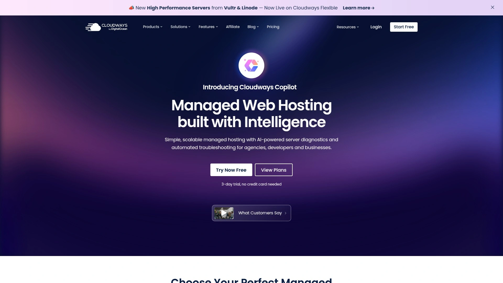

**Platform Flexibility and Management:**
Cloudways removes the complexity of cloud hosting by providing a unified dashboard for managing servers across multiple cloud providers. Users can launch optimized servers in 60+ data centers worldwide within minutes, pre-configured for WordPress, Magento, Laravel, and other popular applications. The platform handles server maintenance, security patches, and performance optimization automatically.

Their ThunderStack includes built-in caching technologies like Varnish, Memcached, and Redis, delivering page load times under 100ms for properly optimized sites. The vertical scaling feature allows RAM and CPU upgrades without migration, while the cloning feature enables risk-free testing of changes. Pricing remains transparent with pay-as-you-go billing and no long-term contracts required.

---

## **[Kinsta](https://kinsta.com)**

Premium managed WordPress hosting powered exclusively by Google Cloud Platform's fastest machines.

Kinsta operates on Google Cloud's C2 machines across 37 data centers, utilizing premium tier network for reduced latency and faster data transfer. Every site runs in an isolated software container with dedicated resources, eliminating the "bad neighbor" effect common in shared hosting. Their infrastructure includes automatic scaling during traffic spikes, ensuring sites remain online during viral moments.

The MyKinsta dashboard provides developers with advanced tools including SSH access, Git integration, and staging environments for every site. Performance features include built-in CDN with 275+ PoPs, automatic database optimization, and PHP 8.2 support. Their expert support team, available 24/7, maintains a 97% satisfaction rating with average initial response times under two minutes.

---

## **[WP Engine](https://wpengine.com)**

Enterprise-grade WordPress hosting with proprietary EverCache technology and automated threat detection.

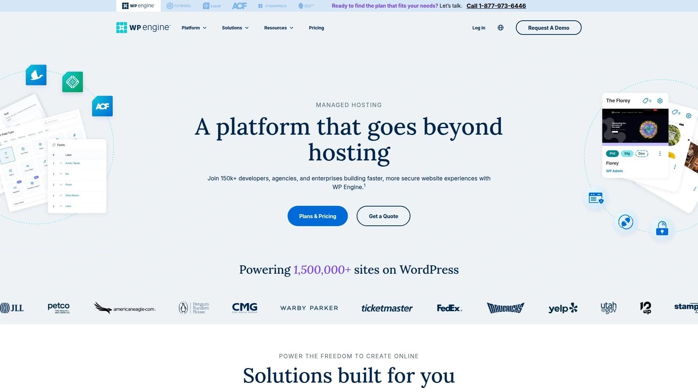

WP Engine's platform serves over 1.5 million websites across 185 countries, processing 5.2 billion requests daily. Their proprietary EverCache system delivers content faster than traditional caching plugins while their automated visual regression testing catches issues before deployment. The platform includes over 35 premium StudioPress themes and Genesis Framework at no additional cost.

**Advanced WordPress Features:**
- Global Edge Security with automated threat blocking
- Smart Plugin Manager for automatic updates and rollbacks
- Transferable sites for easy client handoffs
- Development, staging, and production environments
- Real-time performance monitoring and alerts

---

## **[SiteGround](https://siteground.com)**

Developer-friendly hosting with custom-built performance optimization and industry-leading support.

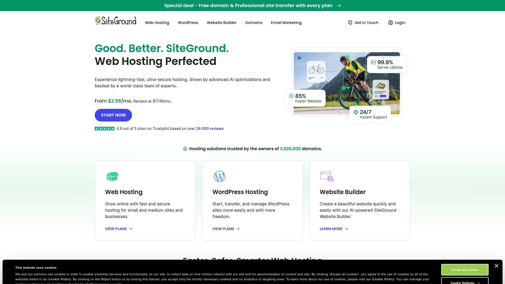

SiteGround operates proprietary technologies including SuperCacher for dynamic caching, custom PHP setup for 30% faster processing, and distributed SSD storage for 1000% better I/O performance. Their infrastructure spans six continents with automatic daily backups stored for 30 days. The company maintains a 99.99% uptime track record verified by independent monitoring.

Customer support distinguishes SiteGround with phone, chat, and ticket options staffed by experts who resolve 95% of inquiries without escalation. Their free site migration service handles unlimited websites for new accounts. The custom Site Tools interface replaces traditional cPanel with a modern, intuitive design optimized for common tasks.

---

## **[Liquid Web](https://liquidweb.com)**

Managed hosting specialist focusing on mission-critical applications with 100% uptime SLA.

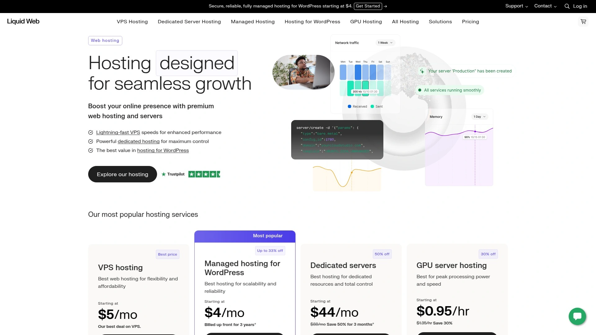

Liquid Web guarantees 100% network and power uptime backed by 10x service credit compensation for any downtime. Their Heroic Support team of hosting experts responds to inquiries in 59 seconds via phone or chat, maintaining a 95% customer satisfaction score. The company owns and operates five data centers with redundant power, cooling, and connectivity systems.

Specialized solutions include managed WooCommerce hosting optimized for online stores, HIPAA-compliant hosting for healthcare applications, and VMware Private Cloud for enterprise workloads. Their Cloud VPS platform includes integrated backups, DDoS protection, and Cloudflare CDN at no extra charge.

---

## **[A2 Hosting](https://a2hosting.com)**

Speed-optimized hosting featuring Turbo Servers delivering up to 20x faster page loads.

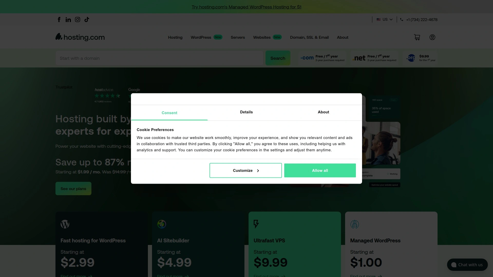

**Performance Innovation:**
A2 Hosting's Turbo Servers utilize LiteSpeed web server technology, NVMe drives, and AMD EPYC processors to achieve exceptional performance. Their pre-configured A2 Optimized software includes advanced caching for WordPress, Joomla, Drupal, and other CMSs. The SwiftServer platform features HTTP/3, Brotli compression, and optimized MySQL configurations.

Free features include SSL certificates, site migration, CloudLinux OS for stability, and their Perpetual Security initiative providing HackScan protection, dual firewall, and brute force defense. Developers appreciate SSH access, multiple PHP versions, and support for Node.js, Python, and Ruby applications.

---

## **[DreamHost](https://dreamhost.com)**

Independent hosting provider with 25+ years experience, offering 97-day money-back guarantee.

DreamHost serves over 1.5 million websites with a commitment to open source and privacy, operating their own data centers powered by renewable energy. Their custom control panel simplifies domain management, email hosting, and one-click installations for 30+ applications. The company maintains transparent pricing with no hidden fees or surprise renewals.

Unique offerings include unlimited bandwidth on all plans, free domain privacy protection, and automated WordPress migrations. Their DreamPress managed WordPress platform includes built-in caching, automatic updates, and staging sites. The 97-day money-back guarantee remains the industry's longest risk-free trial period.

---

## **[Hostinger](https://hostinger.com)**

Budget-friendly hosting delivering premium features through efficient infrastructure and automation.

Hostinger operates a global network serving 29 million users across 178 countries, maintaining data centers on every continent. Their LiteSpeed-powered infrastructure includes built-in caching, HTTP/3 support, and IPv6 connectivity. Despite budget pricing, all plans include weekly backups, SSL certificates, and their custom hPanel control interface.

The platform excels at WordPress hosting with automated installation, staging tools, and WordPress Acceleration powered by LiteSpeed Cache. Their website builder includes AI-powered tools for content generation and design suggestions. Premium features like Git integration, SSH access, and unlimited cronjobs come standard even on basic plans.

---

## **[Bluehost](https://bluehost.com)**

WordPress-recommended hosting provider powering over 2 million websites worldwide.

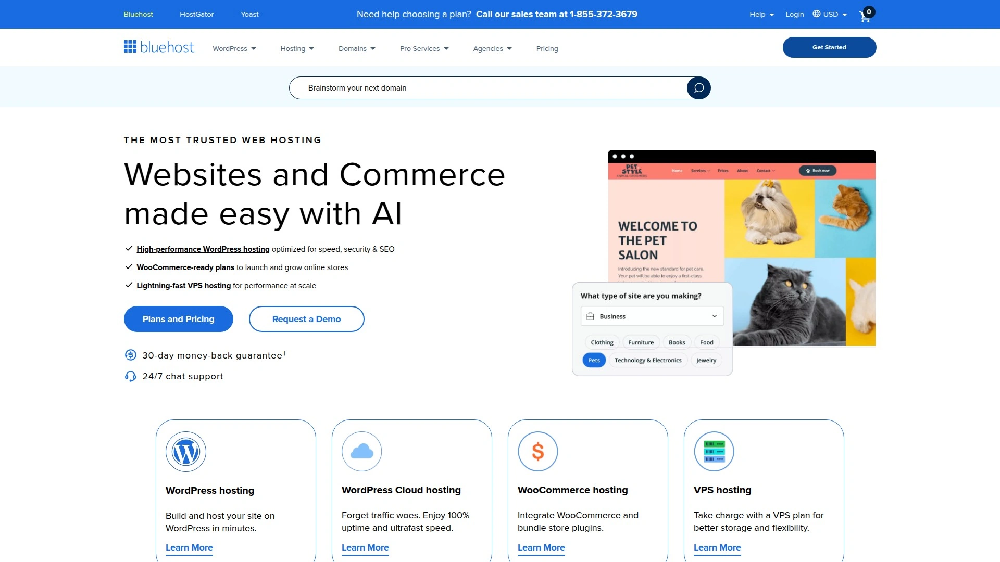

**WordPress Integration Excellence:**
Bluehost's deep WordPress integration includes automatic installation, updates, and specialized support from WordPress experts. Their WP Pro plans feature unlimited websites, malware scanning, and daily backups with CodeGuard. The MOJO Marketplace provides thousands of themes and plugins with seamless installation.

Resource protection ensures consistent performance regardless of traffic spikes on shared servers. Their enhanced cPanel includes drag-and-drop functionality and simplified email management. Marketing credits worth $200 help new websites gain visibility through Google Ads and Microsoft Advertising.

---

## **[GreenGeeks](https://greengeeks.com)**

Eco-friendly hosting platform operating at 300% renewable energy with industry-standard performance.

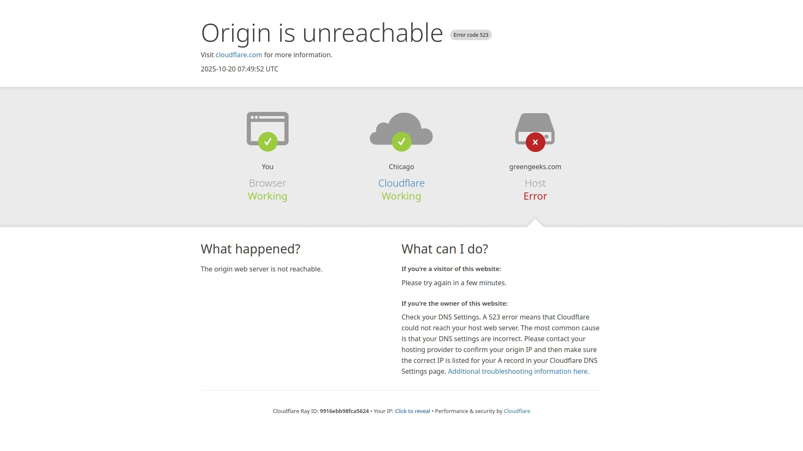

GreenGeeks purchases three times the energy they consume in renewable energy credits, making them carbon-negative. Their infrastructure utilizes energy-efficient hardware, optimized cooling systems, and green data centers. Despite the environmental focus, performance remains competitive with SSD storage, LiteSpeed technology, and built-in CDN.

Technical features include MariaDB databases, multiple PHP versions, and support for Python, Ruby on Rails, and Node.js. Their PowerCacher technology combines multiple caching layers for optimal speed. The platform includes nightly backups, real-time security scanning, and automatic WordPress updates.

---

## **[InMotion Hosting](https://inmotionhosting.com)**

Business-focused hosting with free SSDs, automatic backups, and industry-best 90-day guarantee.

InMotion Hosting targets business customers with features like free dedicated IPs, premium email hosting, and marketing tools. Their Max Speed Zones ensure visitors connect to the nearest data center for optimal performance. The BoldGrid website builder includes professional themes and drag-and-drop customization.

**Business-Class Features:**
- Free domain registration and transfer
- Unlimited email accounts with spam protection
- eCommerce tools with pre-installed shopping carts
- Advanced developer tools including SSH, Ruby, and Perl
- U.S.-based support available 24/7/365

---

## **[HostGator](https://hostgator.com)**

Scalable hosting solutions from shared to dedicated servers with 45-day money-back guarantee.

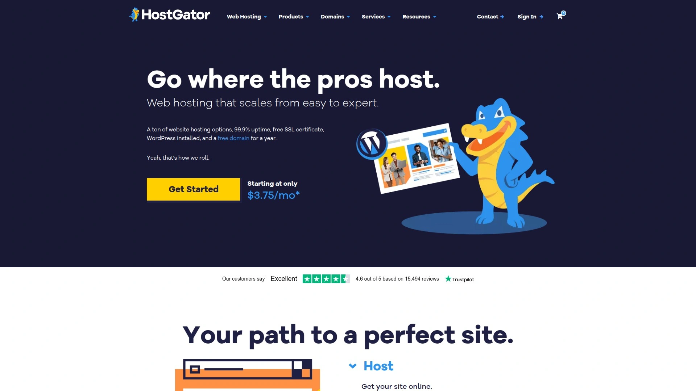

HostGator's infrastructure handles over 9 million domains with 99.9% uptime guarantee and redundant power systems. Their one-click installer supports over 75 applications while the website builder includes hundreds of mobile-responsive templates. Unmetered bandwidth on all plans eliminates overage concerns during traffic surges.

The platform provides flexibility to upgrade seamlessly from shared hosting to VPS or dedicated servers as sites grow. Free website transfers include complete migration of files, databases, scripts, and email accounts. Their control panel integrates billing, support, and server management in a single interface.

---

## **[Namecheap](https://namecheap.com)**

Domain registrar expanded into affordable hosting with focus on privacy and simplicity.

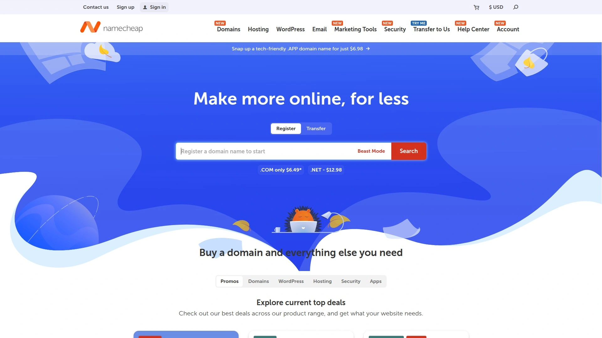

Namecheap leverages their domain expertise to provide integrated hosting solutions with free domain privacy protection. Their EasyWP managed WordPress platform launches sites in 90 seconds with automatic backups and updates. The Supersonic CDN accelerates content delivery across 50+ global locations.

Security features include AutoBackup with 30-day retention, SSL certificates, and two-factor authentication. Their hosting plans include 50 GB SSD storage minimum, unmetered bandwidth, and the ability to host multiple websites. The knowledge base contains over 1,000 articles and video tutorials for self-service support.

---

## **[Nexcess](https://nexcess.net)**

Managed hosting optimized for WordPress, WooCommerce, and Magento with autoscaling technology.

**Platform-Specific Optimization:**
Nexcess specializes in eCommerce hosting with platform-specific optimizations for WooCommerce and Magento. Their autoscaling technology automatically adjusts resources during traffic spikes, preventing crashes during sales events. The platform includes built-in image compression, lazy loading, and database optimization.

StoreBuilder includes premium WooCommerce extensions worth over $3,000 annually. Their visual regression testing catches design breaks before they go live. The platform maintains PCI compliance for secure payment processing with dedicated IP addresses and SSL certificates included.

---

## **[Flywheel](https://getflywheel.com)**

Designer-focused managed WordPress hosting with collaboration tools and beautiful interface.

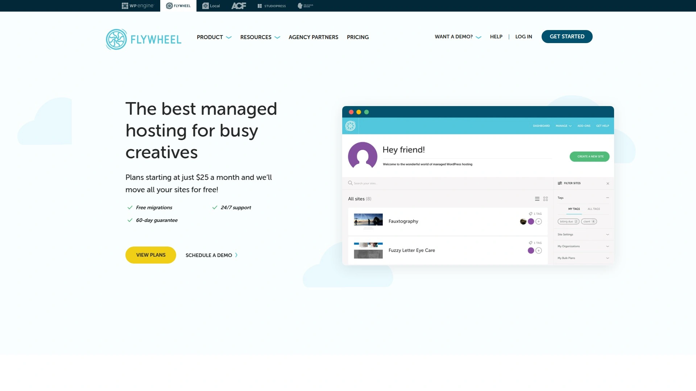

Flywheel caters to agencies and freelancers with features like transferable billing, white-label client portals, and bulk site management. Their blueprint feature enables launching new sites from saved templates. The platform includes free SSL certificates, nightly backups, and malware monitoring.

Collaboration tools allow granting selective access to developers and clients without sharing passwords. Their local development app, Local, integrates seamlessly with hosted sites for push/pull functionality. Performance features include built-in caching, CDN, and automatic image optimization.

---

## **[Vultr](https://vultr.com)**

Cloud infrastructure provider offering high-performance SSD VPS with hourly billing.

Vultr operates 32 data centers globally with 100% SSD storage and Intel CPUs across all instances. Their one-click applications deploy optimized stacks for WordPress, Docker, GitLab, and dozens of other platforms. The control panel provides root access, custom ISO uploads, and instant snapshots.

Pricing starts at $2.50/month with hourly billing ensuring you only pay for actual usage. Advanced features include DDoS protection, dedicated cloud compute, and bare metal servers. Their API enables infrastructure automation and integration with deployment tools.

---

## **[DigitalOcean](https://digitalocean.com)**

Developer-friendly cloud platform with predictable pricing and extensive documentation.

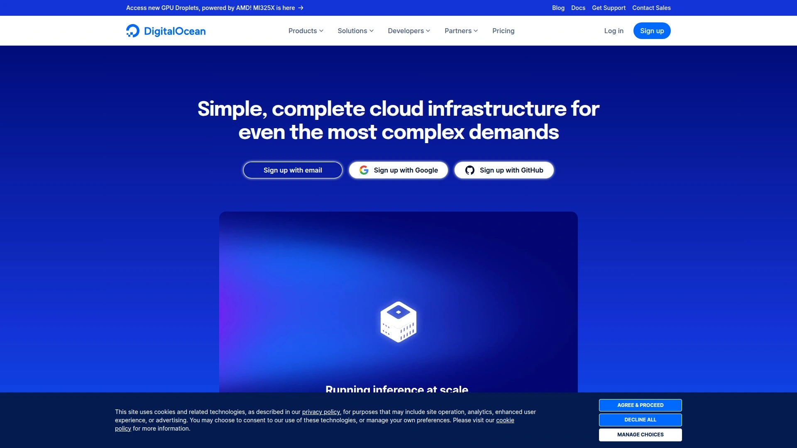

**Developer Experience Focus:**
DigitalOcean simplifies cloud infrastructure with Droplets (virtual machines) deployable in 55 seconds. Their App Platform provides fully managed PaaS for deploying apps without infrastructure management. Managed databases support PostgreSQL, MySQL, MongoDB, and Redis with automatic backups and failover.

The platform includes 3,000+ tutorials and comprehensive API documentation. Pricing remains predictable with no bandwidth charges within reasonable limits. Their marketplace offers 200+ pre-configured 1-Click Apps for common development stacks and applications.

---

## **[Linode](https://linode.com)**

Independent cloud provider emphasizing simplicity, affordability, and developer support.

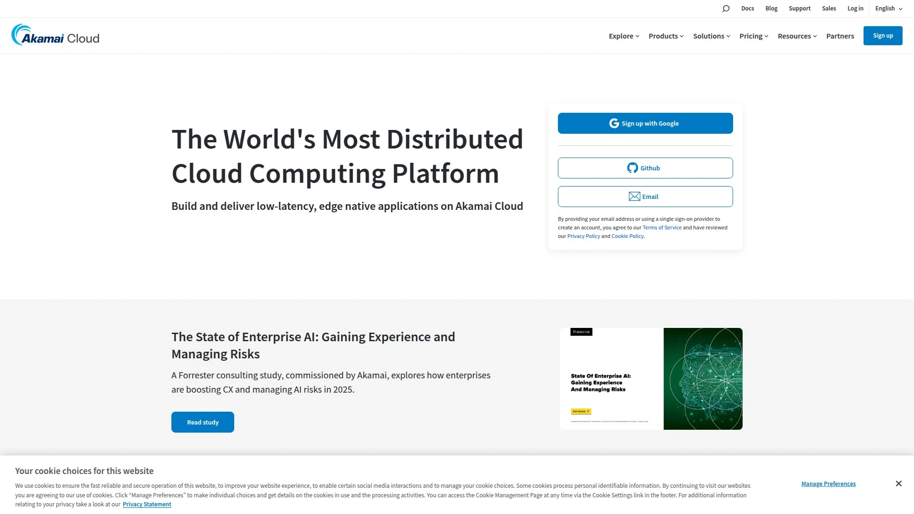

Linode maintains a straightforward approach to cloud hosting with transparent pricing and no surprise fees. Their Shared CPU plans balance performance and cost while Dedicated CPU instances guarantee resources for production workloads. The platform includes NodeBalancers for load balancing and Object Storage compatible with S3.

Support distinguishes Linode with 24/7 availability and no tier system - every customer reaches experienced technicians. Their extensive documentation library covers everything from basic setup to advanced configurations. The Linode CLI and API enable complete infrastructure automation.

---

## **[Scala Hosting (VPS)](https://scalahosting.com)**

Advanced VPS solutions with SPanel control panel eliminating expensive licensing fees.

ScalaHosting's VPS platform deserves special mention for their self-developed SPanel that rivals cPanel functionality without monthly licensing costs. This saves users $15-45 monthly while providing familiar interface and features. Their managed VPS includes free migrations, daily backups, and the SShield security system monitoring for threats 24/7.

The platform supports unlimited websites and email accounts with guaranteed resources that automatically scale during traffic spikes. Their anytime money-back guarantee shows confidence in service quality, refunding unused portions without questions asked.

---

## **[Hostwinds](https://hostwinds.com)**

Customizable hosting solutions with 24/7/365 support and 99.9999% uptime guarantee.

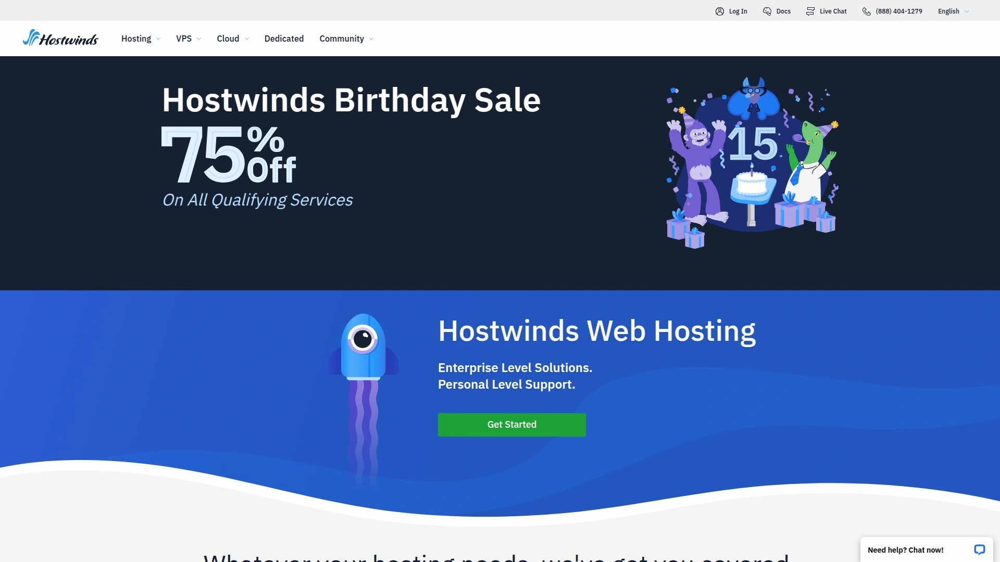

Hostwinds offers extensive customization options for VPS and dedicated servers including choice of OS, control panel, and management level. Their cloud hosting includes hourly billing, load balancers, and object storage. The nightly backup service maintains 7-day rolling backups with one-click restoration.

Technical support operates entirely in-house with no outsourcing, ensuring knowledgeable assistance around the clock. Their monitoring system checks servers every 30 seconds with automatic issue resolution when possible. The company maintains ownership of all hardware and data centers for complete control over service quality.

---

## **[InterServer](https://interserver.net)**

Price-lock guarantee hosting with no renewal rate increases and unlimited storage.

InterServer's price-lock guarantee ensures hosting costs never increase at renewal, a unique offering in the industry. Their standard web hosting includes unlimited storage, bandwidth, and email accounts with weekly backups. The platform supports multiple programming languages including ASP.NET on Linux servers.

Security features include InterShield Security with machine learning malware detection and automatic virus cleaning. Their in-house email delivery system maintains high deliverability rates. The company operates four data centers with redundant network connections and power systems ensuring consistent uptime.

---

# FAQ Common Questions

**Q: Which hosting type should I choose for a new WordPress site expecting moderate traffic?**
A: Start with managed WordPress hosting from providers like ScalaHosting or SiteGround, which handle technical optimization automatically and can scale as your traffic grows without requiring server management expertise.

**Q: How important is data center location for website performance?**
A: Very important - choosing a data center near your primary audience reduces latency by 50-70%. Most providers like ScalaHosting offer multiple locations, and using CDN services can further optimize global performance.

**Q: What's the real difference between shared hosting and VPS hosting?**
A: Shared hosting divides server resources among multiple users causing potential slowdowns, while VPS guarantees dedicated resources ensuring consistent performance. VPS costs more but provides 3-5x better performance and complete server control.

---

# Conclusion

These 22 web hosting providers represent the full spectrum of hosting solutions from budget-friendly shared plans to enterprise cloud infrastructure. Each excels in specific areas whether prioritizing speed, support, or sustainability. [ScalaHosting](https://scalahosting.com) particularly stands out for businesses seeking VPS performance with managed convenience, offering innovative solutions like SPanel that eliminate traditional hosting limitations while maintaining affordability and exceptional support quality.
